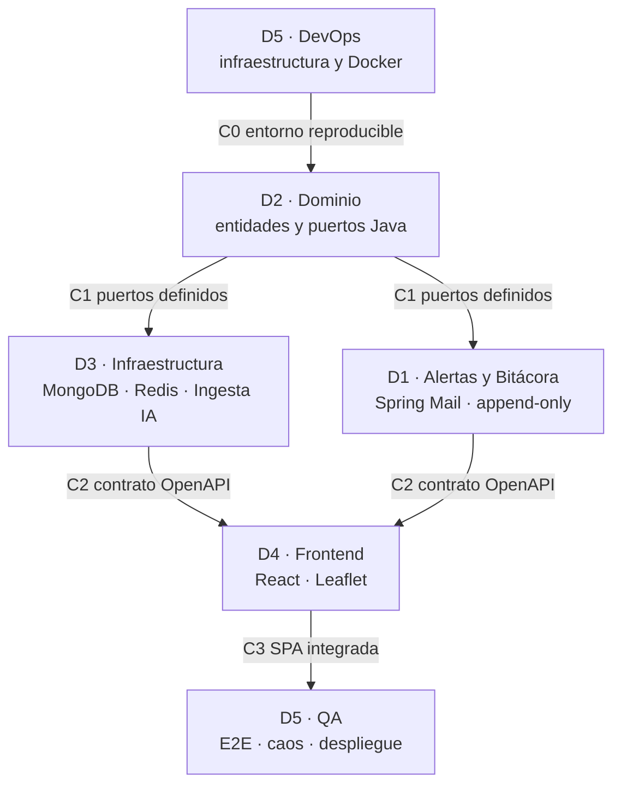

# Secuencia y orden de trabajo del equipo — AguaVigía CTG

> Quién habilita a quién, en qué orden, y cómo se sabe —con un comando, no con una opinión— si una
> tarea ya se puede empezar.
>
> **Seguir esta secuencia es obligatorio.** No es una recomendación de eficiencia: es lo que impide
> que cinco personas y sus agentes de IA construyan cinco versiones incompatibles del mismo sistema.
>
> Quién es cada rol: [`roles-y-tareas.md`](roles-y-tareas.md). Estado actual de las compuertas:
> [`../gestion/registro-de-bloqueos.md`](../gestion/registro-de-bloqueos.md) §1.

---

## 1. Cadena de dependencias técnicas

En Arquitectura Limpia el trabajo no es una fila india: es una **cascada coordinada por capas**.
Dentro de cada paso hay paralelismo; entre pasos hay una compuerta.

---

## 2. Las cuatro compuertas — el mecanismo obligatorio

Una **compuerta** es un artefacto verificable que separa a quien lo produce de quien lo consume.
Mientras está cerrada, quien depende de ella **no empieza**: registra el bloqueo y avisa (§5).

| # | Compuerta | La abre | Habilita a | Artefacto que la abre | Se verifica con |
|---|---|---|---|---|---|
| **C0** | Entorno reproducible | D5 **verifica y declara**; D2 aporta `/backend`, D4 aportó `/frontend` | Todos | Proyectos `/backend` y `/frontend` que compilan, `docker-compose.yml` levantando Mongo, Redis y Mailhog, y CI en verde. **No** incluye los Dockerfiles de backend y frontend: son de los Sprints 1 y 3 | `docker compose up -d --wait && cd backend && ./mvnw clean verify` *(exige un motor de contenedores real corriendo — `docker compose config -q` solo valida YAML y no basta, `BUG-030`)* |
| **C1** | Dominio y puertos | D2 | D3 · D1 | Entidades, objetos de valor y `domain/port/**` fusionados en `develop`, ArchUnit en verde | `ls backend/src/main/java/com/aguavigia/ctg/domain/port/out` |
| **C2** | Contrato OpenAPI | D3 · D1 | D4 | `backend/openapi.yaml` versionado en `develop` | `git show develop:backend/openapi.yaml \| head -5` |
| **C3** | SPA integrada | D4 | D5 (QA) | Frontend consumiendo la API real, build sin errores | `cd frontend && npm run build` |

**Reglas de la compuerta:**

1. **La abre quien la produce, no quien la espera.** D4 no puede declarar abierta la C2.
2. **Se abre con evidencia**: el comando corre y da la salida esperada. Un "ya subí eso" no abre nada.
3. **Quien la abre lo marca** en `registro-de-bloqueos.md` §1 en el mismo PR **y lo avisa al equipo**.
4. **Una compuerta puede estar 🟡 parcial**: C2 abierta para `/api/sectores` pero no para
   `/api/reportes`. Entonces se declara el alcance exacto; fuera de ese alcance sigue cerrada.

---

## 3. El orden paso a paso

### Paso 1 · D5 (DevOps) — prepara el terreno

**Empieza:** siempre. No depende de nadie.
**Cierra abriendo C0.**

1. Inicializa el repositorio y las ramas. **Los proyectos base no los crea D5**: `/frontend` lo hizo
   D4 y `/backend` lo hace D2 (asignado el 2026-08-07). D5 verifica que ambos existan y compilen, y
   entonces declara C0 abierta.
2. Levanta `docker-compose.yml` (MongoDB + Redis + Mailhog).
3. Deja el pipeline de GitHub Actions compilando ambos proyectos.
4. Carga el GeoJSON de barrios de Cartagena. ✅ *Hecho en el Sprint 0 (PRs #2 y #6).*

**La protección de ramas no se configura**: es política documentada, no candado técnico (`ADR-010`).

### Paso 2 · D2 (Backend · dominio) — define el corazón

**Empieza:** con **C0** abierta.
**Cierra abriendo C1.**

1. Entidades (`CorteAgua`, `Sector`, `ReporteCiudadano`) y objetos de valor (`record` inmutables).
2. Test de **ArchUnit** que hace fallar la build si `domain/` importa framework.
3. Interfaces de los puertos (`FuenteDatosPort`, `SectorRepositoryPort`, `NotificacionPort`).

**Por qué va antes que la tecnología:** los puertos son el vocabulario que D3 y D1 implementan. Si se
escriben después de los adaptadores, terminan describiendo a MongoDB en vez de al problema.

### Paso 3 · D3 y D1 (backend técnico) — construyen la tubería

**Empiezan:** con **C1** abierta. Trabajan en paralelo, cada uno sobre sus propios puertos.
**Cierran abriendo C2**, cada uno la parte del contrato que le corresponde.

- **D3**: adaptadores de MongoDB (`2dsphere`), Redis (`ZSET`), pipeline de ingesta con IA (M9) y
  publicación de la especificación OpenAPI con `springdoc`.
- **D1**: Spring Mail contra Mailhog, bitácora inmutable *append-only* y endpoints de suscripción.

### Paso 4 · D4 (Frontend) — construye la experiencia

**Empieza:** con **C2** abierta, al menos parcialmente y con alcance declarado.
**Cierra abriendo C3.**

1. `npm run api:sync` para generar el cliente tipado desde el contrato. **Los tipos se generan; no se
   escriben a mano** — un tipo escrito a mano es una copia que empieza a mentir el día que cambia el
   backend.
2. Mapa Leaflet (M1), reporte en 2 toques (M2), panel del veedor (M5), bitácora (M8).
3. Tokens visuales de `DESIGN.md` y accesibilidad WCAG AA.

**Sin C2, D4 no está ocioso:** maquetación, tokens, rutas, estados de carga y vacío, y pruebas de
accesibilidad estáticas no cruzan la compuerta. Lo que no se puede es inventar la forma de los datos.

### Paso 5 · D5 (QA) — valida, prueba y despliega

**Empieza:** con **C3** abierta.

1. Pruebas E2E con Playwright.
2. Prueba de caos: apagar las fuentes externas y verificar que el sistema degrada sin mentir.
3. Despliegue de backend y frontend (Render / MongoDB Atlas / Upstash).

---

## 4. Hoja de ruta resumida por sprint

> Qué hace cada persona en cada sprint. El objetivo del sprint, el entregable que lo cierra y las
> ceremonias están en [`../gestion/README.md`](../gestion/README.md); no se repiten aquí.

| Sprint | Enfoque principal | D5 (DevOps/QA) | D2 (Dominio) | D3 (Infra/IA) | D1 (Full-Stack/IA Docs) | D4 (Frontend) |
|---|---|---|---|---|---|---|
| **Sprint 0** | Configuración e infraestructura | Repositorio, Docker Compose, CI/CD, GeoJSON de barrios | Proyecto base de `/backend` (asignado 2026-08-07) | — | ⚠️ *sin titular — ver BL-003* | Esqueleto React + Vite, tokens CSS |
| **Sprint 1** | Mapa base y dominio core | Script de siembra del GeoJSON en Mongo | Entidades Java, ArchUnit, puertos | Adaptador Mongo, API Sectores, OpenAPI | API Suscripción, `@Async` Mail, prompts (Cap. I) | Mapa Leaflet, lista accesible |
| **Sprint 2** | Reporte ciudadano y consenso | Testcontainers, JaCoCo | Lógica de consenso (patrón Strategy) | Rate limit Redis, `POST /api/reportes` | Doble opt-in, prompts (Cap. II) | Formulario en 2 toques, SSE |
| **Sprint 3** | Administración y alertas | Docker Nginx frontend | Reglas de corte oficial (Builder) | CRUD cortes veedor, JWT | Backend bitácora (M8), prompts (Cap. III) | Panel del veedor, formulario de alertas |
| **Sprint 4** | Ingesta IA y Cumplimiento ⭐ | Dashboard M7, prueba de caos | `CalcularCumplimientoService` | **Pipeline M9 IA**, `citaTextual` | Timeline bitácora, tabular encuestas | UI del Índice de Cumplimiento |
| **Sprint 5** | Calidad, accesibilidad y PWA | E2E Playwright, despliegue | Cobertura JaCoCo ≥ 70% | Agregaciones Mongo, reproceso IA | Integración correo/bitácora, trazabilidad | Auditoría axe WCAG AA, PWA offline |
| **Sprint 6** | Entrega final y demostración | Dataset mayo–julio 2026 | Diagrama de clases, SOLID | Diagrama de componentes | Capítulo IV e informe final | Manual de usuario, ajustes 3G |

---

## 5. Protocolo para los agentes de IA — cómo saber si se puede avanzar

> Cinco personas trabajan aquí con agentes. Un agente que no sabe distinguir *"esto me toca"* de
> *"esto depende de otro"* produce, muy rápido y con mucha confianza, exactamente el desastre que
> esta secuencia evita. Estas reglas son de cumplimiento obligatorio para el agente, y el humano
> tiene el deber de exigirlas.

### Antes de la primera línea de cualquier tarea

1. **Identifica el rol de la tarea** (D1–D5) y la compuerta de la que depende, según §2.
2. **Verifícala corriendo su comando.** No basta con leer la tabla de estado: la tabla puede estar
   desactualizada, el repositorio no. Este proyecto ya pagó una vez el precio de afirmar sin
   comprobar (`MEMORY.md`, corrección del 2026-08-06).
3. **Decide con la tabla siguiente. No hay una cuarta opción.**

| Resultado de la verificación | Qué hace el agente |
|---|---|
| Compuerta **abierta** y la tarea es del rol correcto | Avanza |
| Compuerta **cerrada** o parcial fuera de alcance | **Se detiene**, registra el bloqueo, avisa en el chat y propone trabajo alterno |
| La tarea pertenece a **otro rol** | No la ejecuta. Lo dice y ofrece prepararle el insumo a su titular |
| No logra determinar de qué depende | **Pregunta.** No supone |

### Anunciar el resultado siempre — no solo cuando bloquea

**Regla del equipo, 2026-08-07.** No basta con detenerse y avisar cuando hay bloqueo (siguiente
sección): **en toda tarea, la respuesta del agente dice explícitamente** si se puede avanzar o si hay
que esperar a que otro rol adelante algo — aunque la respuesta sea "sí, se puede avanzar". Callar la
verificación cuando todo está en orden deja a la persona (o a su compañero) preguntándose si alguien
la hizo. Aplica a cualquiera de los cinco, no solo a quien abrió esta conversación.

Una línea, al empezar cualquier tarea, con uno de estos dos formatos:

- ✅ **Se puede avanzar** — compuerta `C<N>` verificada con su comando, abierta · o la tarea no depende
  de ninguna compuerta.
- 🚧 **Hay que esperar** — igual que el aviso de bloqueo de la sección siguiente.

**En el chat, con la persona, sin códigos.** Los `C<N>` y los nombres de puerto (`FuenteDatosPort`,
etc.) son para el registro escrito (`registro-de-bloqueos.md`, este documento). Al hablar con un
integrante, se explica en términos de **personas y entregables concretos**, no de códigos de
compuerta — nadie debería tener que abrir este documento para entender por qué está esperando.

| En vez de esto | Se dice así |
|---|---|
| "C1 está cerrada, no puedes avanzar" | "Todavía no puedes empezar: falta que Carlos suba las entidades del dominio" |
| "Depende de C0" | "Depende de que exista el proyecto base del backend" |
| "El puerto de D2 no está definido" | "Falta que Carlos defina cómo el backend va a hablar con la base de datos" |

El código de compuerta y el detalle técnico sí van en el registro escrito — ahí es donde importan para
la trazabilidad del Capítulo IV.

### Al detectar un bloqueo — las tres cosas, siempre

1. **Detenerse** en la parte bloqueada. No en toda la sesión: en esa tarea.
2. **Registrar** en `docs/gestion/registro-de-bloqueos.md` con la skill **`registrar-bloqueo`**,
   incluyendo el comando y su salida real.
3. **Avisar en el chat**, con el formato de la skill: qué no se puede hacer, de qué compuerta y de
   qué titular depende, qué se verificó, dónde quedó registrado, en qué **sí** se puede avanzar
   mientras tanto, y qué se necesita del equipo.

**Registrar sin avisar no cuenta, y avisar sin registrar tampoco.** El aviso desatasca a una persona
hoy; el registro es lo que el Capítulo IV podrá contar en el Sprint 6.

Lo mismo al revés: cuando una compuerta se abre, el agente **lo verifica, lo marca y lo anuncia**.
Un compañero bloqueado de más por falta de aviso cuesta lo mismo que un bloqueo real.

### Prohibido para rodear un bloqueo

Estas cuatro salidas parecen productivas el lunes y cuestan un sprint en la integración:

- ❌ **Inventar el contrato faltante**: tipos TypeScript escritos a mano, DTOs "provisionales",
  respuestas simuladas que nadie retira.
- ❌ **Escribir en la capa de otro rol** para destrabarse.
- ❌ **Cambiar la firma de un puerto ajeno** sin su titular.
- ❌ **"Avanzo ahora y después lo ajusto."** Después es el Sprint 6.

**Excepción única:** un **desbloqueo temporal** autorizado por escrito por el titular de la
compuerta, registrado en `registro-de-bloqueos.md` §4 con fecha de caducidad, alcance exacto e issue
de reconciliación. Si caduca sin reconciliar, se convierte en bug S2.

### Frontera de propiedad

Un agente **lee** cualquier archivo del repositorio; **modifica** los de su rol. Para tocar el
módulo de otro: se propone el cambio y lo revisa su titular
([`roles-y-tareas.md`](roles-y-tareas.md) §Reglas de colaboración). La única excepción son los
archivos compartidos por diseño (`docs/gestion/*`, `MEMORY.md`, `docs/design-decisions.md`), que
todos alimentan.
