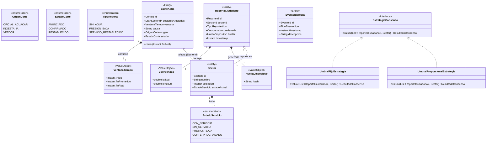

# Diagrama de Clases del Dominio y Principios SOLID

Este documento detalla el Diagrama de Clases del Dominio de Agua-Vigía y la justificación de cómo se aplican los principios SOLID en el contexto de nuestra Arquitectura Limpia (Clean Architecture). Este entregable es parte del Sprint 6 (D2 - Dominio).

## 1. Diagrama de Clases (Dominio)

A continuación se presenta el modelo de dominio mediante un diagrama de clases estructurado, evidenciando las entidades, objetos de valor (*Value Objects*), agregados y puertos de la arquitectura.

---

## 2. Aplicación de los Principios SOLID en la Arquitectura Limpia

La arquitectura del sistema ha sido diseñada priorizando un alto nivel de cohesión y un bajo nivel de acoplamiento. La separación de responsabilidades a través de los principios SOLID asegura que el core del negocio (el Dominio) se mantenga intacto y libre de dependencias de infraestructura, bases de datos o frameworks (reglas de la Arquitectura Limpia).

### Single Responsibility Principle (SRP)
**Principio de Responsabilidad Única:** Cada clase, módulo o capa debe tener una y solo una razón para cambiar.
*   **En el Dominio:** Las entidades representan conceptos únicos y cohesionados. Por ejemplo, `CorteAgua` maneja exclusivamente el estado y las transiciones del ciclo de vida de un corte (ej., `cerrar(Instant finReal)` es su única transición a restablecido). No sabe cómo guardarse en una base de datos ni cómo ser serializado a JSON.
*   **En los Casos de Uso (`port/in`):** En lugar de servicios "God Class" (ej. `SistemaService`), se diseñan casos de uso atómicos, como `EvaluarConsensoUseCase` o `RegistrarReporteUseCase`. Cada clase atiende un único flujo de negocio.

### Open/Closed Principle (OCP)
**Principio de Abierto/Cerrado:** Las entidades de software (clases, módulos, funciones, etc.) deben estar abiertas a la extensión, pero cerradas a la modificación.
*   **En el Dominio (Patrón Strategy):** La interfaz `EstrategiaConsenso` permite introducir nuevas formas de calcular los consensos (ej. una futura estrategia basada en IA o un modelo mixto) creando una nueva clase que la implemente, sin necesidad de tocar el código de `UmbralFijoEstrategia`, `UmbralProporcionalEstrategia` o los casos de uso que la invocan.
*   **En la Arquitectura:** Los adaptadores de infraestructura están aislados de la lógica del núcleo. Si el día de mañana se cambia de MongoDB a PostgreSQL, el código de dominio no necesita ninguna modificación.

### Liskov Substitution Principle (LSP)
**Principio de Sustitución de Liskov:** Las clases derivadas deben poder sustituir a sus clases base sin alterar el correcto funcionamiento del programa.
*   **En el Dominio:** Cualquier implementación de la interfaz `EstrategiaConsenso` puede ser inyectada en el `EvaluarConsensoUseCase` y funcionar perfectamente. Los contratos (entradas y salidas de datos, ej., `ResultadoConsenso`) se respetan rigurosamente.

### Interface Segregation Principle (ISP)
**Principio de Segregación de Interfaces:** Los clientes no deben verse obligados a depender de interfaces que no utilizan.
*   **En los Puertos de Salida (`port/out`):** En lugar de tener un gigantesco `DatabaseRepository` que declare todos los métodos (CRUD de sectores, reportes, eventos y cortes), se han definido interfaces atómicas y específicas como `SectorRepository`, `CorteAguaRepository`, y `ContadorReportesPort`. Los casos de uso inyectan únicamente los repositorios que realmente necesitan.
*   **Gestión del Tiempo:** El `RelojPort` expone únicamente `Instant.now()`. Esto impide que la capa de dominio dependa de utilidades sistémicas pesadas, y facilita el uso de *mocks* precisos para pruebas (ej. validar invariantes en la clase `VentanaTiempo`).

### Dependency Inversion Principle (DIP)
**Principio de Inversión de Dependencias:** Los módulos de alto nivel (Dominio) no deben depender de los módulos de bajo nivel (Infraestructura). Ambos deben depender de abstracciones (interfaces).
*   **En la Arquitectura Limpia:** La capa de `domain` y `application` no importa anotaciones de frameworks (como `@Document` de MongoDB, `@Entity` de JPA o `@Service` de Spring). Los servicios de aplicación dependen de abstracciones (interfaces de puertos, ej., `ContadorReportesPort`), y es la capa externa de infraestructura (ej., `RedisContadorReportesAdapter`) la que depende de esas abstracciones para proporcionar la implementación concreta y funcional. Esto invierte la tradicional dependencia de "Capa de Negocio → Capa de Datos".
