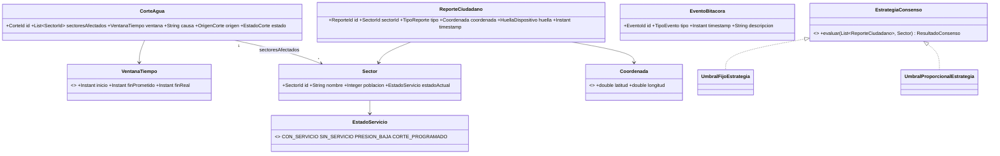

# Modelo de dominio — D2 (M3 · Consenso, M6 · Índice de Cumplimiento)

> Diseño de `domain/` y `application/` adelantado en Sprint 0, mientras **C0** sigue cerrada (no
> existe `/backend` todavía). Documentación pura — nada de esto es código. Cuando C0 abra, este
> documento se traduce directo a Java 21 (`record`, sin Lombok, cero imports de Spring/MongoDB).
>
> **Titular:** D2 (Carlos Bechara Arias) · **Trazabilidad:** RF009–RF011, RF016–RF017, RF020–RF022
> (`docs/product-requirements.md`) · **Restricciones heredadas:** ADR-003, ADR-007
> (`docs/design-decisions.md`).

---

## 1. Value Objects

| Nombre | Campos | Invariante | RF / origen |
|---|---|---|---|
| `Coordenada` | `latitud: double`, `longitud: double` | Rango válido de latitud/longitud | RF007 |
| `VentanaTiempo` | `inicio: Instant`, `finPrometido: Instant`, `finReal: Instant?` | `finPrometido > inicio`; si `finReal` existe, no precede a `inicio` | RF016, RF017 |
| `EstadoServicio` | enum: `CON_SERVICIO`, `SIN_SERVICIO`, `PRESION_BAJA`, `CORTE_PROGRAMADO` | Cerrado — el "sin dato" se resuelve en presentación, no en el dominio | RF001, `DESIGN.md` §2 |
| `HuellaDispositivo` | `hash: String` | No reversible a identidad real | ADR-007 |

## 2. Entidades

| Entidad | Campos clave | Nota |
|---|---|---|
| `Sector` | `id`, `nombre`, `poblacion: Integer?`, `estadoActual: EstadoServicio` | La geometría GeoJSON es dato de infraestructura (D3); el dominio solo necesita identidad, población y estado. `poblacion` es nulable: §3.1. |
| `CorteAgua` | `id`, `sectoresAfectados: List<SectorId>`, `ventana: VentanaTiempo`, `causa`, `origen` (`OFICIAL_ACUACAR`\|`INGESTA_IA`\|`VEEDOR`), `estado` (`ANUNCIADO`\|`CONFIRMADO`\|`RESTABLECIDO`) | Se construye con **Builder** — impide `finPrometido < inicio` (recomendación explícita de `D2-backend-dominio.md` §4) y valida que `estado`/`ventana.finReal()` sean coherentes. Expone `cerrar(Instant finReal)` como única transición autorizada a `RESTABLECIDO` — cierra la ventana y marca el estado atómicamente, así ningún caller puede dejarlos inconsistentes. |
| `ReporteCiudadano` | `id`, `sectorId`, `tipo` (`SIN_AGUA`\|`PRESION_BAJA`\|`SERVICIO_RESTABLECIDO`), `coordenada?`, `huella: HuellaDispositivo`, `timestamp` | RF005–RF007. |
| `EventoBitacora` | `id`, `tipo`, `sectorId?`, `corteId?`, `timestamp`, `descripcion` | Inmutable, solo anexado. La creación de negocio pasa por `EventoBitacoraFactory`; el constructor del record sigue público solo para que `EventoBitacoraMongoAdapter` rehidrate eventos ya existentes — RF026–028. |

## 3. Patrones de diseño (evidencia SOLID/GoF para sustentación)

| Patrón | Dónde | RF / Sprint |
|---|---|---|
| **Strategy** | `EstrategiaConsenso`: `UmbralFijoEstrategia`, `UmbralProporcionalEstrategia` | RF010 · Sprint 2 |
| **Builder** | `CorteAgua.Builder` | RF016 · Sprint 3 |
| **Factory Method** | `EventoBitacoraFactory` — `corteAnunciado`, `corteRestablecido`, `consensoConfirmado` | RF026 · implementado |
| **Specification** *(pendiente)* | Filtros de M7 (estadísticas) | Sprint 4, no urgente ahora |

### 3.1 Decisión — `Sector.poblacion` es nulable

El PR #13 (D5, siembra de sectores) encontró que **27 de 211 barrios no tienen población** en la
fuente censal (DANE 2018 + CORVIVIENDA) — corregimientos rurales/insulares que el censo no cubre. No
se inventa un número.

**Decisión:** `poblacion` es `Integer` nulable, no `int`. `UmbralProporcionalEstrategia` (RF010) cae a
la misma lógica que `UmbralFijoEstrategia` cuando `poblacion == null` — un sector sin dato censal no
se queda sin consenso posible, usa el umbral fijo como respaldo. Se documenta así en vez de con un
`0` centinela, que sería indistinguible de un barrio real sin habitantes.

## 4. Puertos — lo que abre C1

**`port/in`** (un caso de uso = una clase):

| Caso de uso | Firma | RF |
|---|---|---|
| `RegistrarReporteUseCase` | `(sectorId, tipo, coordenada?, huella) -> ReporteCiudadano` | RF005–RF007 |
| `EvaluarConsensoUseCase` | `(sectorId) -> ResultadoConsenso` | RF009–RF011 |
| `GestionarCorteOficialUseCase` | `registrar(...)`, `cerrar(corteId, horaReal)` | RF016, RF017 |
| `CalcularCumplimientoUseCase` | `porCorte(corteId)`, `porSector(sectorId)`, `global()` | RF020–RF022 |
| `RegistrarEventoBitacoraUseCase` | `(evento) -> void` | RF026 |

**`port/out`** (lo que `application/` necesita de infraestructura, lo implementa D3):

| Puerto | Responsabilidad | Adaptador esperado |
|---|---|---|
| `SectorRepository`, `CorteAguaRepository`, `ReporteCiudadanoRepository`, `EventoBitacoraRepository` | Persistencia | MongoDB (ADR-003) |
| `ContadorReportesPort` | Ventana deslizante de reportes por sector | Redis (ADR-003) |
| `RelojPort` | `Instant.now()` inyectable | Reloj del sistema — sin esto, las invariantes de `VentanaTiempo` no son testeables sin mockear tiempo real |

## 5. Contradicción resuelta — `SuscribirseService`

`D2-backend-dominio.md` (Sprint 3) tenía "Implementar `SuscribirseService`" duplicado con
`D1-notificaciones-bitacora.md`, dueño real de M4 (tabla "Resumen del equipo" en `roles-y-tareas.md`:
D1 posee `application/`, `infrastructure/mail/`, `api/` y `frontend/` para M4 completo, suscripción
incluida). Era un error de copiado al armar las tablas de sprint, no una decisión entre alternativas.
**Corregido 2026-08-07**: se quitó la línea de `D2-backend-dominio.md`. D2 no toca `SuscribirseService`.

## 6. Diagrama de clases (borrador)

## 7. Siguiente paso

Cuando exista `/backend` y C0 abra: este documento se traduce a `domain/` (Value Objects como
`record`, entidades, `EstrategiaConsenso`) y `application/` (los cinco casos de uso de `port/in`),
en ese orden — el test de ArchUnit (Sprint 1) se escribe primero para que la build falle si algo
importa Spring o MongoDB desde el minuto uno.
