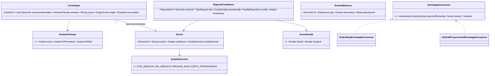

# Modelo de dominio (M3 · Consenso, M6 · Índice de Cumplimiento)

> Diseño de `domain/` y `application/` adelantado en Sprint 0, antes de que existiera `/backend`.
> Documentación pura — nada de esto es código. Este
> documento se traduce directo a Java 21 (`record`, sin Lombok, cero imports de Spring/MongoDB).
>
> **Estado (2026-09-29): modelo de Sprint 0, ya construido y superado.** Lo concreto de abajo
> (firmas, nombres de clase) se corrigió contra el código; el alcance no. El dominio real tiene
> entidades que aquí no aparecen (`Usuario`, `Suscripcion`, `SuscripcionTelegram`,
> `PropuestaIngesta`, `EventoAuditoria`, `TokenCuenta`) y 34 casos de uso en `domain/port/in/`, no
> cinco. Diagrama al día: `diagrama-de-clases.md`.
>
> **Trazabilidad:** RF009–RF011, RF016–RF017, RF020–RF022
> (`docs/product-requirements.md`) · **Restricciones heredadas:** ADR-003, ADR-007
> (`docs/design-decisions.md`).

---

## 1. Value Objects

| Nombre | Campos | Invariante | RF / origen |
|---|---|---|---|
| `Coordenada` | `latitud: double`, `longitud: double` | Rango válido de latitud/longitud | RF007 |
| `VentanaTiempo` | `inicio: Instant`, `finPrometido: Instant`, `finReal: Instant?` | `finPrometido > inicio`; si `finReal` existe, no precede a `inicio` | RF016, RF017 |
| `EstadoServicio` | enum: `CON_SERVICIO`, `SIN_SERVICIO`, `PRESION_BAJA`, `CORTE_PROGRAMADO` | Cerrado — el "sin dato" se resuelve en presentación, no en el dominio | RF001, `DESIGN.md` §2 |
| `HuellaDispositivo` | `hash: String` | No reversible a identidad real | ADR-007 |

## 2. Entidades

| Entidad | Campos clave | Nota |
|---|---|---|
| `Sector` | `id`, `nombre`, `poblacion: Integer?`, `estadoActual: EstadoServicio` | La geometría GeoJSON es dato de infraestructura; el dominio solo necesita identidad, población y estado. `poblacion` es nulable: §3.1. |
| `CorteAgua` | `id`, `sectoresAfectados: List<SectorId>`, `ventana: VentanaTiempo`, `causa`, `origen` (`OFICIAL_ACUACAR`\|`INGESTA_IA`\|`VEEDOR`), `estado` (`ANUNCIADO`\|`CONFIRMADO`\|`RESTABLECIDO`) | Se construye con **Builder** — impide `finPrometido < inicio` y valida que `estado`/`ventana.finReal()` sean coherentes. Expone `cerrar(Instant finReal)` como única transición autorizada a `RESTABLECIDO` — cierra la ventana y marca el estado atómicamente, así ningún caller puede dejarlos inconsistentes. |
| `ReporteCiudadano` | `id`, `sectorId`, `tipo` (`SIN_AGUA`\|`PRESION_BAJA`\|`SERVICIO_RESTABLECIDO`), `coordenada?`, `huella: HuellaDispositivo`, `timestamp` | RF005–RF007. |
| `EventoBitacora` | `id`, `tipo`, `sectorId?`, `corteId?`, `timestamp`, `descripcion` | Inmutable, solo anexado. La creación de negocio pasa por `EventoBitacoraFactory`; el constructor del record sigue público solo para que `EventoBitacoraMongoAdapter` rehidrate eventos ya existentes — RF026–028. |

## 3. Patrones de diseño (evidencia SOLID/GoF para sustentación)

| Patrón | Dónde | RF / Sprint |
|---|---|---|
| **Strategy** | `EstrategiaConsenso` (`boolean seAlcanzaConsenso(long reportesRecientes, Sector sector)`): `UmbralFijoEstrategiaConsenso`, `UmbralProporcionalEstrategiaConsenso` | RF010 · Sprint 2 |
| **Builder** | `CorteAgua.Builder` | RF016 · Sprint 3 |
| **Factory Method** | `EventoBitacoraFactory` — `corteAnunciado`, `corteRestablecido`, `consensoConfirmado`, `detectadoPorIngesta` | RF026 · implementado |
| **Specification** *(pendiente)* | Filtros de M7 (estadísticas) | Sprint 4, no urgente ahora |

### 3.1 Decisión — `Sector.poblacion` es nulable

El PR #13 (siembra de sectores) encontró que **27 de 211 barrios no tienen población** en la
fuente censal (DANE 2018 + CORVIVIENDA) — corregimientos rurales/insulares que el censo no cubre. No
se inventa un número.

**Decisión:** `poblacion` es `Integer` nulable, no `int`. `UmbralProporcionalEstrategiaConsenso` (RF010)
cae a su `umbralMinimo` cuando `poblacion == null` (`domain/UmbralProporcionalEstrategiaConsenso.java:26-28`) — un sector sin dato censal no
se queda sin consenso posible, usa el umbral fijo como respaldo. Se documenta así en vez de con un
`0` centinela, que sería indistinguible de un barrio real sin habitantes.

## 4. Puertos — lo que abre C1

**`port/in`** (un caso de uso = una clase). Los cinco que abrió C1; hoy son 34 (`domain/port/in/`):

| Caso de uso | Firma | RF |
|---|---|---|
| `RegistrarReporteUseCase` | `registrar(sectorId, tipo, coordenada?, huella, boolean esSensor) -> ReporteCiudadano` | RF005–RF007 |
| `EvaluarConsensoUseCase` | `evaluar(sectorId) -> ResultadoConsenso`, `evaluarPendientes()` | RF009–RF011 |
| `GestionarCorteOficialUseCase` | `registrar(...)`, `cerrar(corteId, horaReal)` | RF016, RF017 |
| `CalcularCumplimientoUseCase` | `porCorte(corteId)`, `porSector(sectorId)`, `global()` | RF020–RF022 |
| `RegistrarEventoBitacoraUseCase` | `(evento) -> void` | RF026 |

**`port/out`** (lo que `application/` necesita de infraestructura, lo implementa infraestructura):

| Puerto | Responsabilidad | Adaptador esperado |
|---|---|---|
| `SectorRepository`, `CorteAguaRepository`, `ReporteCiudadanoRepository`, `EventoBitacoraRepository` | Persistencia | MongoDB (ADR-003) |
| `ContadorReportesPort` | Ventana deslizante de reportes por sector | Redis (ADR-003) |
| `RelojPort` | `Instant ahora()` inyectable | Reloj del sistema — sin esto, las invariantes de `VentanaTiempo` no son testeables sin mockear tiempo real |

## 5. Diagrama de clases (borrador)

```mermaid
classDiagram
  class Coordenada { <<record>> +double latitud +double longitud }
  class VentanaTiempo { <<record>> +Instant inicio +Instant finPrometido +Instant finReal }
  class EstadoServicio { <<enumeration>> CON_SERVICIO SIN_SERVICIO PRESION_BAJA CORTE_PROGRAMADO }

  class Sector { +SectorId id +String nombre +Integer poblacion +EstadoServicio estadoActual }
  class CorteAgua { +CorteId id +List~SectorId~ sectoresAfectados +VentanaTiempo ventana +String causa +OrigenCorte origen +EstadoCorte estado }
  class ReporteCiudadano { +ReporteId id +SectorId sectorId +TipoReporte tipo +Coordenada coordenada +HuellaDispositivo huella +Instant timestamp }
  class EventoBitacora { +EventoId id +TipoEvento tipo +Instant timestamp +String descripcion }

  class EstrategiaConsenso { <<interface>> +seAlcanzaConsenso(long reportesRecientes, Sector sector) boolean }
  class UmbralFijoEstrategiaConsenso
  class UmbralProporcionalEstrategiaConsenso
  EstrategiaConsenso <|.. UmbralFijoEstrategiaConsenso
  EstrategiaConsenso <|.. UmbralProporcionalEstrategiaConsenso

  CorteAgua --> VentanaTiempo
  CorteAgua "1" --> "*" Sector : sectoresAfectados
  ReporteCiudadano --> Sector
  ReporteCiudadano --> Coordenada
  Sector --> EstadoServicio
```

## 7. Siguiente paso (cumplido)

El plan de Sprint 0 era traducir este documento a `domain/` y `application/` (los cinco casos de uso
de `port/in`) con el test de ArchUnit escrito primero. Se hizo así y el dominio siguió creciendo:
34 casos de uso en `domain/port/in/`. El diagrama del §5 queda como borrador histórico; el vigente es
`diagrama-de-clases.md`.
